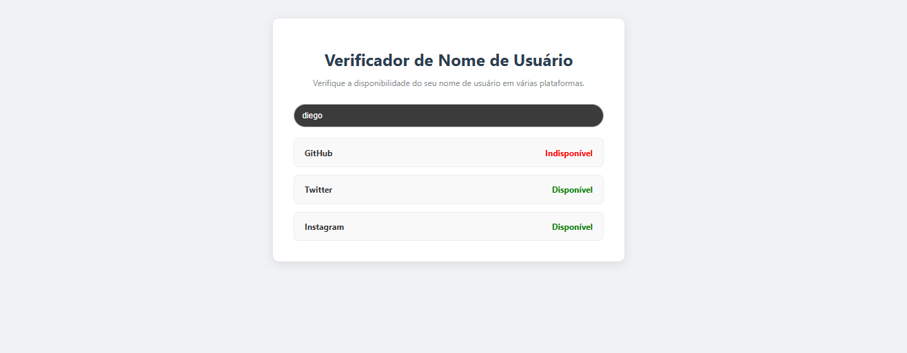

# Verificador de Disponibilidade de Nome de Usuário

Este é um aplicativo que verifica a disponibilidade de um nome de usuário em plataformas online em tempo real. O projeto foi desenvolvido para ajudar o usuário a encontrar um nome de usuário único, evitando a frustração de tentar criar contas com nomes já ocupados.

## Tecnologias

- **React**: Biblioteca JavaScript para a construção de interfaces de usuário reativas e componentizadas.
- **TypeScript**: Adiciona tipagem estática, garantindo um código mais seguro e robusto.
- **Vite**: Ferramenta de build moderna e rápida para o ambiente de desenvolvimento.
- **Axios**: Cliente HTTP baseado em Promessas, usado para fazer as requisições à API.

## Funcionalidades

- **Verificação em Tempo Real**: A disponibilidade do nome de usuário é verificada enquanto o usuário digita.
- **Debounce de Requisições**: O sistema espera 500ms após a última digitação para fazer a chamada à API, otimizando o número de requisições e melhorando a performance.
- **Estado Dinâmico**: O estado do aplicativo muda de acordo com a resposta da API, exibindo mensagens de "Verificando...", "Disponível" ou "Indisponível".
- **Integração com API Real**: Utiliza a API pública do GitHub para verificar a disponibilidade de um nome de usuário de forma autêntica.
- **UI Limpa e Responsiva**: A interface é intuitiva e se adapta a diferentes tamanhos de tela.

## Como Executar o Projeto

Para rodar a aplicação localmente, siga os seguintes passos no seu terminal:

1.  Navegue até o diretório do projeto:
    ```bash
    cd verificador-de-usuario
    ```
2.  Instale as dependências:
    ```bash
    npm install
    ```
3.  Inicie o servidor de desenvolvimento:
    ```bash
    npm run dev
    ```

A aplicação estará disponível em `http://localhost:5173/`.

## Estrutura do Projeto

- **`src/App.tsx`**: Contém a lógica principal da aplicação, incluindo o gerenciamento do estado, a integração com o Axios, o hook `useEffect` para o debounce e a estrutura de componentes.
- **`src/App.css`**: Define a estilização do aplicativo, incluindo as cores de status e a animação do spinner.
- **`src/main.tsx`**: Ponto de entrada da aplicação, onde o componente `App` é montado no DOM.

## Funcionalidades Futuras

O projeto pode ser expandido para incluir as seguintes funcionalidades:

1.  **Verificação de Múltiplas Plataformas**: Integrar com outras APIs públicas que permitam a verificação de nomes de usuário (ex: Twitter, LinkedIn, etc.), se disponíveis.
2.  **Cache de Requisições**: Implementar um sistema de cache para evitar múltiplas chamadas à API para o mesmo nome de usuário.
3.  **Sugestões de Nome**: Gerar e exibir nomes de usuário alternativos e disponíveis caso o nome escolhido esteja indisponível.
4.  **UX Aprimorada**: Adicionar transições e animações para tornar a experiência do usuário ainda mais fluida.

---

## Detalhamento do projeto


